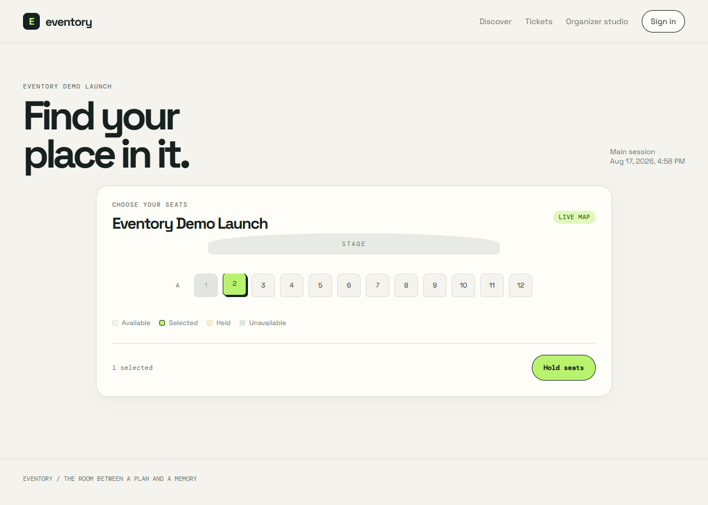
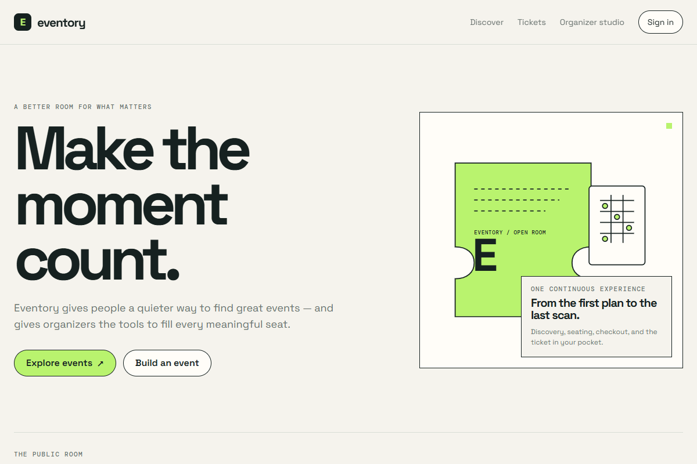
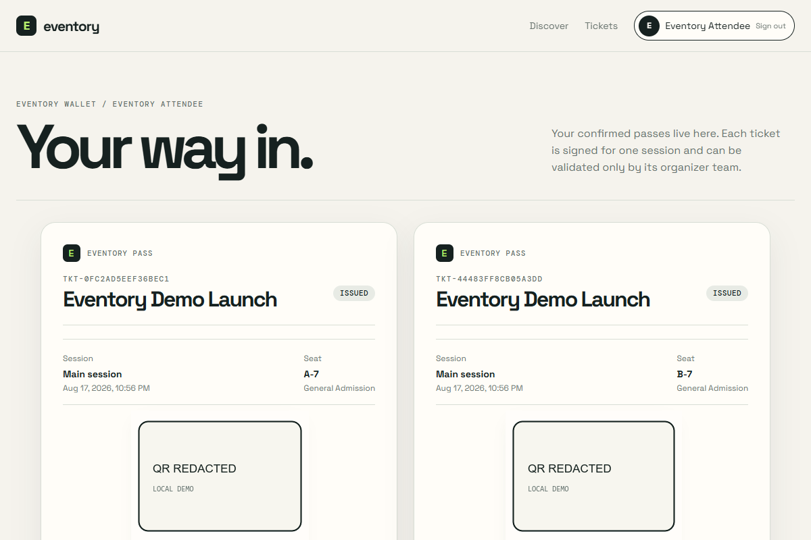
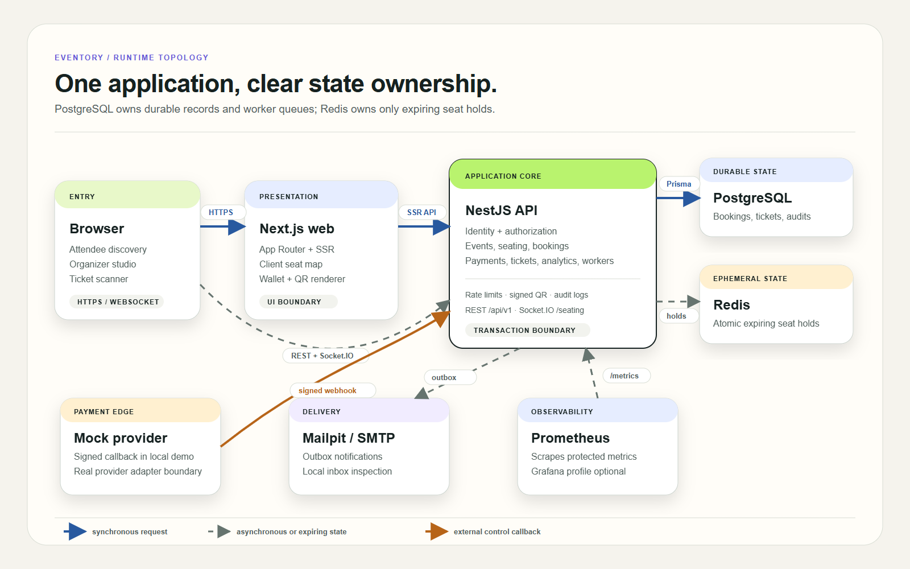
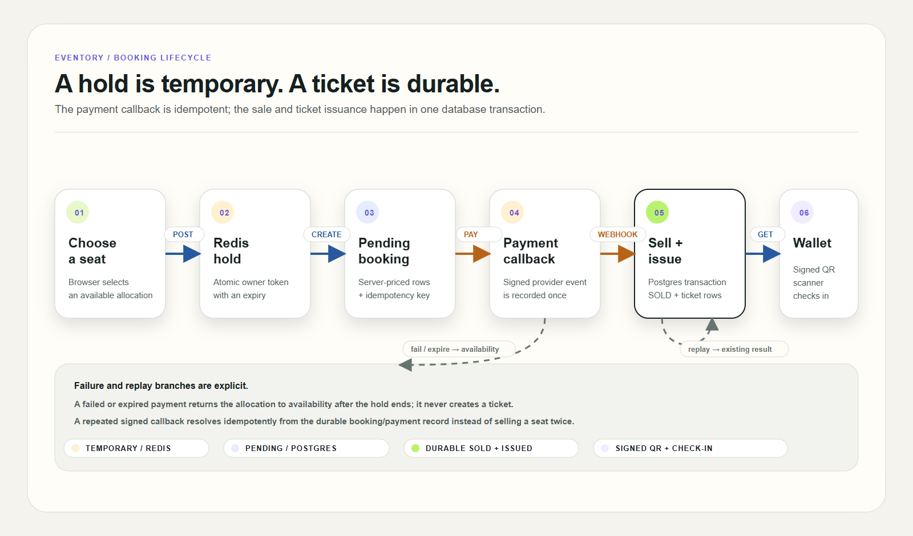

# Eventory

Eventory is a production-oriented full-stack event ticketing platform. It is designed as a modular monolith so the project can demonstrate reliable booking, real-time seat holds, simulated payments, signed QR tickets, authorization, observability, testing, and delivery automation without pretending that every feature needs a separate service.

[](https://github.com/JasonTM17/Eventory/actions/workflows/main.yml)
[](https://github.com/JasonTM17/Eventory/actions/workflows/release.yml)

## Repository status

The audited release baseline is `v0.1.2` from
`c3abeb64013fa88dc80b3550591462b2e4bdbd25`. Its
[release workflow](https://github.com/JasonTM17/Eventory/actions/runs/30869248045)
published matching container manifests to Docker Hub and GHCR. The validation
badge above tracks `main`; registry publication is not deployment.

## Stack

- pnpm workspaces + Turborepo
- Next.js App Router + React + TypeScript
- NestJS modular monolith + Prisma
- PostgreSQL, Redis, in-process booking reconciliation/outbox workers, and Mailpit
- Docker Compose and GitHub Actions

## Product preview

These artifacts were captured from a seeded local application stack and show
the public discovery, seat-selection, checkout, and ticket-wallet flows.
Payment is a deterministic mock provider, email delivery uses Mailpit or any
SMTP-compatible local transport, and this repository does not claim a hosted
public demo or production payment-provider connection. The wallet screenshot
redacts its locally generated signed QR payload before it is committed.








## Prerequisites

- Node.js 22 or newer
- pnpm 11 (`corepack enable` is recommended)
- Docker Desktop for PostgreSQL, Redis, and Mailpit integration work

## Quick start

```bash
pnpm install --frozen-lockfile
docker compose up --build -d
docker compose ps
```

Compose waits for PostgreSQL, Redis, and Mailpit, applies API migrations at
startup, and exposes the web app at [http://localhost:3000](http://localhost:3000)
and API at [http://localhost:4000/api/v1](http://localhost:4000/api/v1). Seed a
deterministic demo after the stack is healthy:

```bash
pnpm db:seed
```

The seed creates the published demo event with sales already open so the
discovery, seat-hold, checkout, and ticket flows can be exercised locally.

For host development, use `docker compose up -d postgres redis mailpit`, then
`pnpm db:migrate` and `pnpm dev`. Copy `.env.example` to `.env` when changing
ports or secrets. Never use the local defaults in production.

## Quality gates

```bash
pnpm format:check
pnpm lint
pnpm typecheck
pnpm package:check
pnpm --filter @eventory/web test
pnpm test:integration
pnpm --filter @eventory/web build
pnpm audit --prod
docker compose config --quiet
```

Enable local Prometheus/Grafana with
`docker compose --profile monitoring up -d prometheus grafana`; see the
[observability guide](./docs/architecture/observability.md).

`pnpm test:integration` owns a temporary dependencies-only Compose project. It
publishes PostgreSQL, Redis, and Mailpit on dynamic ports, proves the database
is `eventory_test`, applies migrations there, runs the API suite, and cleans up
only that project. It never starts the application or outbox workers.

## Architecture





Read the [system overview](./docs/architecture/system-overview.md), [component boundaries](./docs/architecture/component-diagram.md), and [implementation plan](./docs/implementation-plan.md) before changing a module. Important trade-offs are recorded as ADRs under [`docs/adr`](./docs/adr).

The concise [codebase summary](./docs/codebase-summary.md), [architecture
guide](./docs/system-architecture.md), [code standards](./docs/code-standards.md),
[PDR](./docs/project-overview-pdr.md), and [roadmap](./docs/project-roadmap.md)
are useful onboarding entry points.

## Workspace package delivery

Every workspace package is private. `pnpm package:check` builds the compiled
configuration package, dry-runs config/contracts/UI/ESLint/TypeScript tarballs,
and compares every payload against an exact allow-list. The verifier also fails
when a declared `main` or `types` entrypoint is absent. Config ships `dist`,
contracts and UI retain their intentional source entrypoints, and the root
ESLint configuration consumes the packaged shared preset. This validates the
npm boundary without publishing the private workspaces; application containers
are released separately.

## Release packages

Release `0.1.2` publishes the application images for `linux/amd64` from source
commit `c3abeb64013fa88dc80b3550591462b2e4bdbd25`:

| Service | GitHub Container Registry                                                                                            | Docker Hub                                                                                |
| ------- | -------------------------------------------------------------------------------------------------------------------- | ----------------------------------------------------------------------------------------- |
| API     | [`ghcr.io/jasontm17/eventory-api:0.1.2`](https://github.com/users/JasonTM17/packages/container/package/eventory-api) | [`nguyenson1710/eventory-api:0.1.2`](https://hub.docker.com/r/nguyenson1710/eventory-api) |
| Web     | [`ghcr.io/jasontm17/eventory-web:0.1.2`](https://github.com/users/JasonTM17/packages/container/package/eventory-web) | [`nguyenson1710/eventory-web:0.1.2`](https://hub.docker.com/r/nguyenson1710/eventory-web) |

The [GitHub Release](https://github.com/JasonTM17/Eventory/releases/tag/v0.1.2)
records the immutable digests and full source-SHA tags.

| Service | Manifest digest                                                           |
| ------- | ------------------------------------------------------------------------- |
| API     | `sha256:305e2e4ff3edb739da87bff67e2c74bbc465bf45cfdf1063407883496f19db6f` |
| Web     | `sha256:737e054e5e64f2ed9716939764a9da7ccbd089e57b2c5d6a2427f65a827e3629` |

OCI provenance and SBOM attestations accompany each image. Registry
publication is not a public deployment: the API still requires reviewed
runtime secrets and services, and the web image uses the local-stack API URL
unless rebuilt with `NEXT_PUBLIC_API_BASE_URL`.

## Development rules

- Keep changes small and runnable; use Conventional Commits.
- Run the narrowest relevant format, lint, typecheck, and test commands before committing.
- Do not commit `.env` files, credentials, tokens, or personal data.
- PostgreSQL is the source of truth for permanent seat ownership; Redis is only for expiring holds.
- Backend authorization is the security boundary. UI checks improve UX but never replace API policy checks.

See [CONTRIBUTING.md](./CONTRIBUTING.md) and [SECURITY.md](./SECURITY.md) for the working agreement.

## License

This project is licensed under the MIT License. See [LICENSE](./LICENSE).
