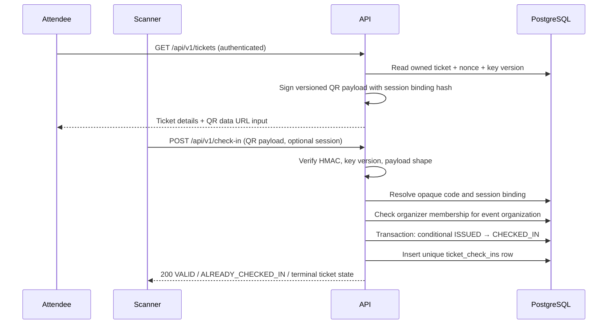

# Ticket and check-in sequence

The QR payload contains a version, opaque ticket code, a one-way event-session
binding, nonce, key version, and signature. It does not contain names, email
addresses, or raw database identifiers. A scanner must be online so PostgreSQL
remains authoritative; the unique `ticket_id` constraint and conditional status
update decide concurrent scans. Successful responses use `VALID`,
`ALREADY_CHECKED_IN`, `TICKET_VOID`, `TICKET_REFUNDED`, or `EVENT_CANCELLED`.
Malformed or tampered QR values return `400`, a wrong event returns `409`, and
authorization failures propagate separately.
