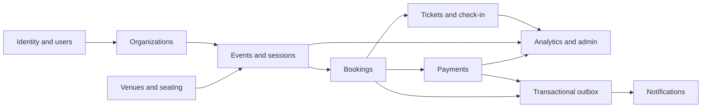

# Eventory component boundaries

Each box maps to a NestJS module with domain/application/infrastructure/presentation folders where the boundary is useful. Small modules may keep fewer layers, but they cannot bypass authorization, transaction, or event contracts.
