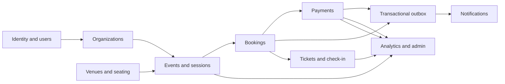

# Eventory business capability flow

This diagram shows business flow, not the NestJS import graph. Services are
organized primarily as flat Nest modules and may share Prisma transactions
across capabilities. Authorization, transaction, webhook-inbox,
reconciliation, and outbox contracts remain explicit even when one service
coordinates several tables.
