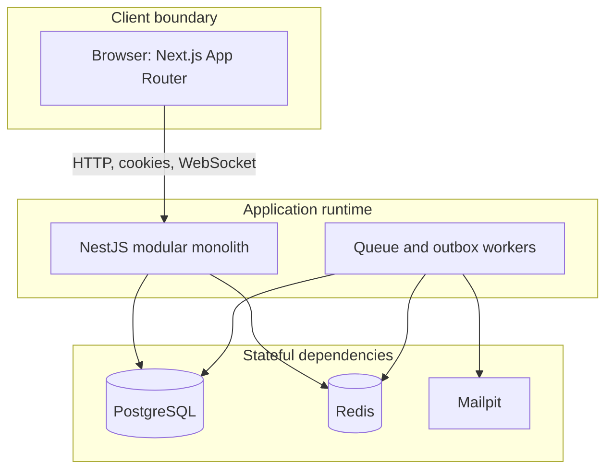

# Eventory container diagram

The web app and API may run as separate containers but remain one product boundary. Workers share the API codebase and domain contracts while running as a separate process profile when queue throughput requires it.
