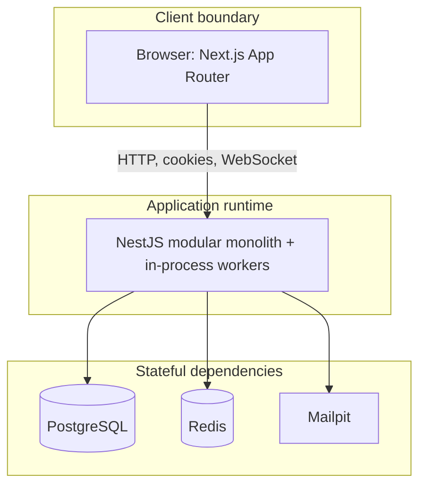

# Eventory container diagram

The web app and API may run as separate containers but remain one product
boundary. Workers share the API codebase and domain contracts and execute
inside the API process, gated by feature flags rather than a separate worker
container.
