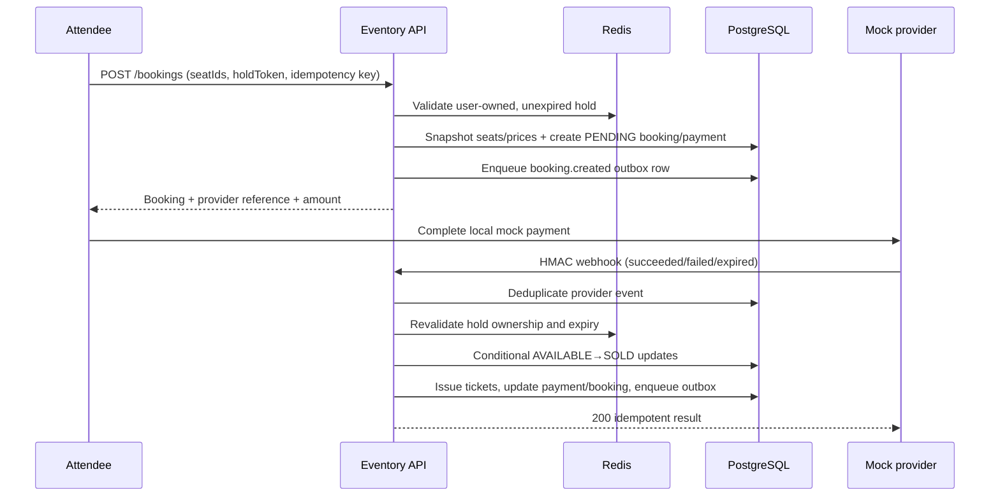

# Booking and payment sequence

```mermaid
sequenceDiagram
    participant A as Attendee
    participant API as Eventory API
    participant R as Redis
    participant DB as PostgreSQL
    participant P as Mock provider

    A->>API: POST /bookings (seatIds, holdToken, idempotency key)
    API->>R: Validate user-owned, unexpired hold
    API->>DB: Snapshot seats/prices + create PENDING booking/payment
    API->>DB: Enqueue booking.created outbox row
    API-->>A: Booking + provider reference + amount
    A->>P: Complete local mock payment
    P->>API: HMAC webhook (succeeded/failed/expired)
    API->>DB: Deduplicate provider event
    API->>R: Revalidate hold ownership and expiry
    API->>DB: Conditional AVAILABLE→SOLD updates
    API->>DB: Issue tickets, update payment/booking, enqueue outbox
    API-->>P: 200 idempotent result
```

The database transaction is the durable boundary. Redis holds are temporary admission evidence; the browser never controls the amount or confirmation state.
