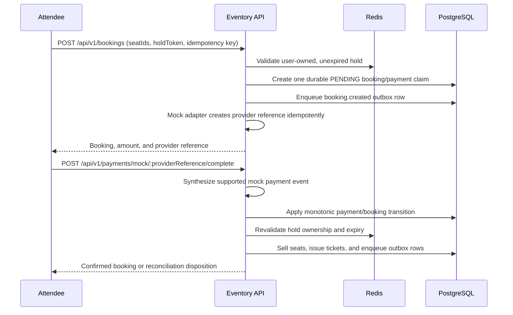
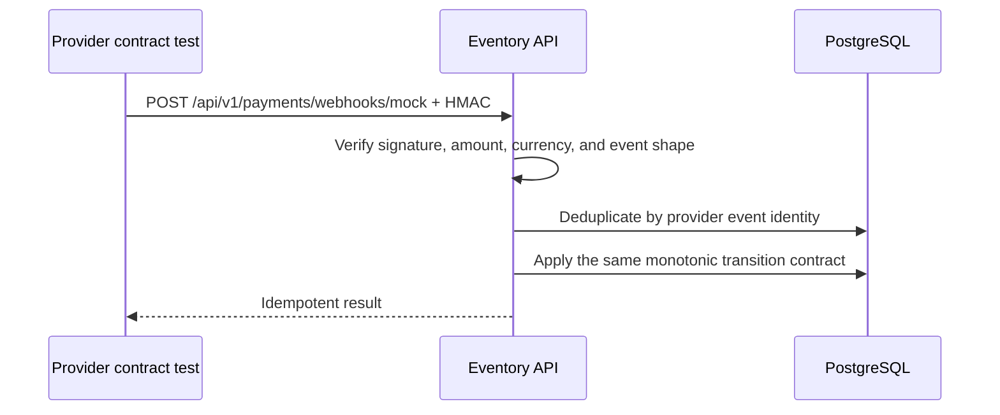

# Booking and payment sequences

## Local demo completion

## Signed webhook contract

The database transaction is the durable boundary. Redis holds are temporary
admission evidence; the browser never controls amount or confirmation state.
The current provider is an in-process deterministic adapter. Late captures are
not auto-refunded or auto-issued: they remain visible through the reconciliation
table, audit record, and `eventory_payment_reconciliations_open` metric.
