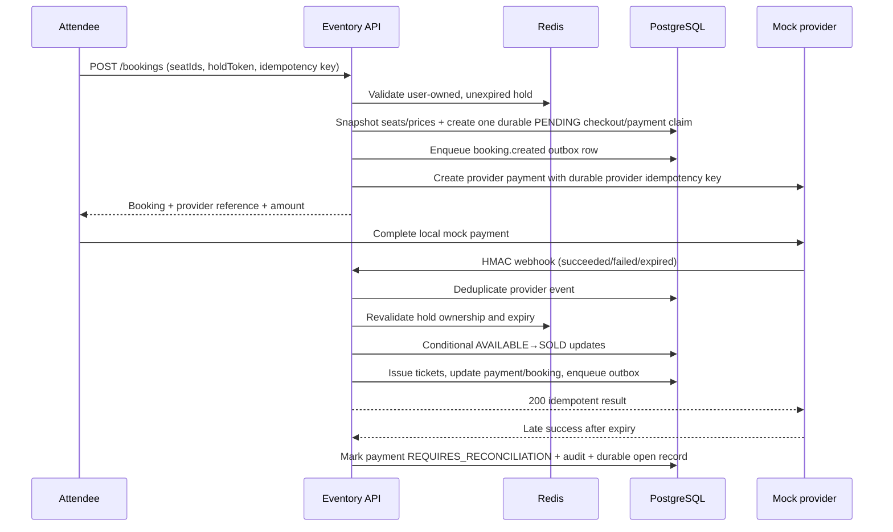

# Booking and payment sequence

The database transaction is the durable boundary. Redis holds are temporary
admission evidence; the browser never controls the amount or confirmation state.
Late captures are not auto-refunded or auto-issued in the mock contract: they
remain visible to operators through the reconciliation table, audit record, and
`eventory_payment_reconciliations_open` metric.
