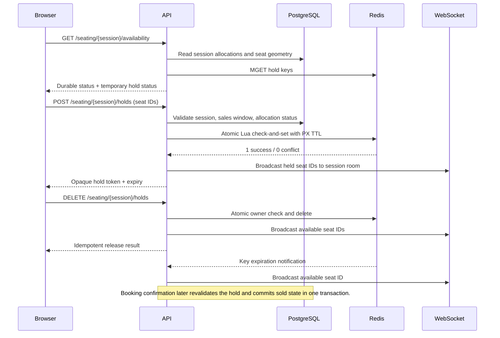

# Seat reservation sequence

Clients treat WebSocket messages as hints and refresh availability after reconnect, expiry, or a conflict response. No client claim or Redis value is enough to issue a ticket.
