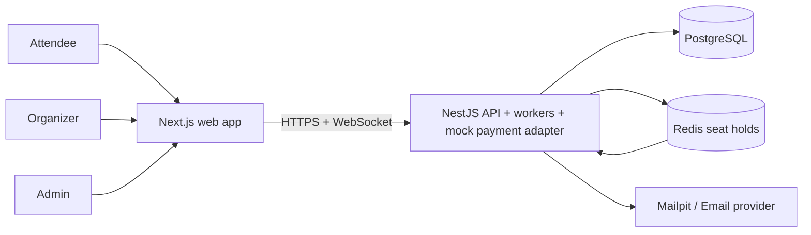

# Eventory system overview

Eventory is a modular monolith with one web application and one API process.
PostgreSQL owns durable business state. Redis provides atomic expiring seat
holds and expiry notifications. In-process polling workers handle the
PostgreSQL outbox and booking reconciliation. Payment and email are isolated
behind replaceable adapters; the current payment adapter runs inside the API.

## System context

## Trust boundaries

1. Browser to API: untrusted input, cookie/CSRF/origin checks, DTO validation, request limits.
2. API to PostgreSQL: transaction boundary and least-privilege database credentials.
3. API to Redis: expiring holds only; no assumption that Redis is durable.
4. Payment webhook to API: signed provider boundary, replay/idempotency checks.
5. Organizer scanner to check-in API: signed QR plus event/resource authorization.

## Module dependency rules

- Business controllers and gateways delegate to services; business invariants
  live in services and policies.
- Services own validation, transactions, and orchestration. They may inject the
  shared `PrismaService` directly, including for cross-domain transactions.
- Cross-module calls use exported Nest providers. External payment and email
  boundaries use explicit adapters; the transactional outbox carries durable
  side effects.
- Persistence ownership is a review convention, not a mechanically enforced
  repository layer.
