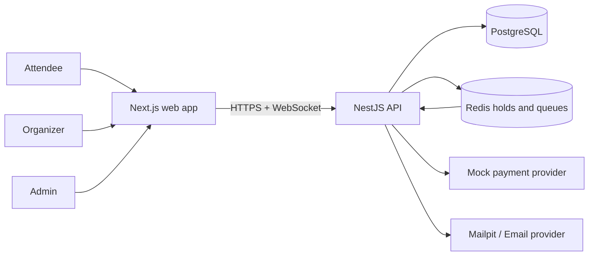

# Eventory system overview

Eventory is a modular monolith with one web application and one API process. PostgreSQL owns durable business state; Redis provides expiring coordination and queues; workers execute retryable side effects. External payment and email systems are represented by replaceable adapters.

## System context

## Trust boundaries

1. Browser to API: untrusted input, cookie/CSRF/origin checks, DTO validation, request limits.
2. API to PostgreSQL: transaction boundary and least-privilege database credentials.
3. API to Redis: expiring holds only; no assumption that Redis is durable.
4. Payment webhook to API: signed provider boundary, replay/idempotency checks.
5. Organizer scanner to check-in API: signed QR plus event/resource authorization.

## Module dependency rules

- Presentation controllers/gateways call application services; they do not contain business invariants.
- Application services own commands, policies, transactions, and ports.
- Infrastructure implements ports for Prisma, Redis, queues, email, payments, and QR signing.
- Domain types do not import framework adapters.
- Cross-module communication uses explicit application contracts or outbox events; no database table writes from another module’s controller.
