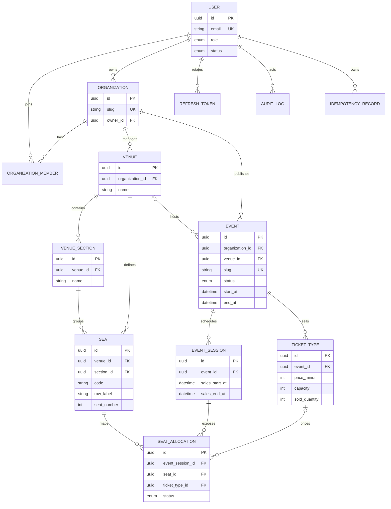

# Eventory database ERD

PostgreSQL is the durable source of truth for identity, organizations, venue geometry, event configuration, and event inventory. Redis may hold temporary reservations, but it never owns a seat after a booking is committed.

## Invariants and indexes

- `organizations.slug` and `events.slug` are public, stable lookup keys; UUIDs remain the canonical resource identifiers.
- A seat is unique within a venue by `code`, and within a section by `(row_label, seat_number)`.
- A session exposes a seat at most once through `(event_session_id, seat_id)`.
- Public discovery uses `(status, start_at)`; organizer views use `(organization_id, status, start_at)`.
- Seat availability queries use `(event_session_id, status)`, while ticket capacity queries use `(ticket_type_id, status)`.
- Foreign keys cascade configuration children when a venue or event is removed. Purchased-ticket tables introduced later must use immutable snapshots and must not rely on deleting this configuration data.
- Booking, payment, ticket, and check-in tables extend the same durable model: bookings snapshot selected prices/seats, tickets carry opaque QR material, and `ticket_check_ins.ticket_id` is unique.
- Analytics filters are bounded by event/session and date window. Existing event-session/status/date indexes plus the unique check-in key keep aggregate reads bounded and concurrent admission authoritative.
