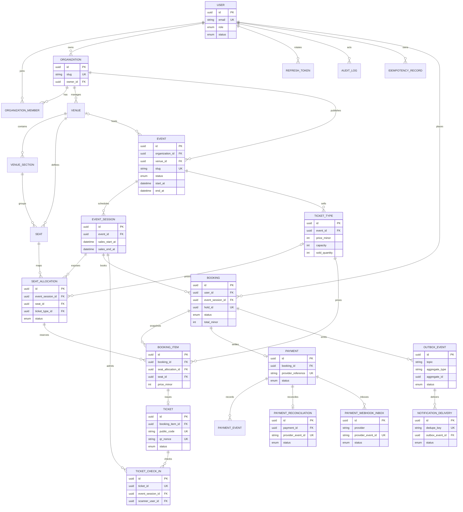

# Eventory database ERD

PostgreSQL is the durable source of truth for identity, organizations, venue
geometry, event configuration, booking snapshots, payment inbox/reconciliation
state, tickets, check-ins, and outbox notifications. Redis may hold expiring
reservations, but it never owns a seat after a booking is committed.

## Invariants and indexes

- `organizations.slug` and `events.slug` are public, stable lookup keys; UUIDs
  remain the canonical resource identifiers.
- A seat is unique within a venue by `code`, and within a section by `(row_label, seat_number)`.
- A session exposes a seat at most once through `(event_session_id, seat_id)`.
- Public discovery uses `(status, start_at)`; organizer views use `(organization_id, status, start_at)`.
- Seat availability queries use `(event_session_id, status)`, while ticket capacity queries use `(ticket_type_id, status)`.
- Booking, payment, ticket, webhook inbox, reconciliation, and outbox tables all carry unique keys for idempotent retries instead of relying on Redis.
- Booking items snapshot the sold seat, price, and ticket type; tickets carry opaque QR material; `ticket_check_ins.ticket_id` is unique.
- Analytics requests enforce an event/session and a maximum one-year date
  window. Production query-plan and latency validation remain required; add
  indexes only from representative `EXPLAIN (ANALYZE, BUFFERS)` evidence.
