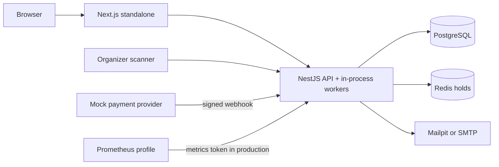

# Eventory system architecture

Eventory is a modular monolith: one NestJS API, one Next.js application, and
replaceable integration adapters. The design keeps business invariants close
to the PostgreSQL transaction while using Redis only for short-lived
coordination. Outbox and booking-reconciliation workers run inside the API
process behind feature flags; they are not separate deployable services.

## Runtime topology

See the [system overview](./architecture/system-overview.md), [component
diagram](./architecture/component-diagram.md), [seat sequence](./architecture/seat-reservation-sequence.md),
[payment sequence](./architecture/payment-sequence.md), and [check-in
sequence](./architecture/check-in-sequence.md) for detailed flows.

## Module boundaries

Identity/authentication, organizations, venues, events, seating, bookings,
payments, outbox, tickets, check-in, analytics, admin, health, and metrics are
separate Nest modules. The auth boundary uses a dedicated session-origin guard
on register/login/refresh, while the global CSRF guard still protects
authenticated mutations. Controllers do not write tables directly. Shared
contracts and UI primitives are framework-light packages.

## State ownership

| State                   | Owner                        | Invariant                                                |
| ----------------------- | ---------------------------- | -------------------------------------------------------- |
| Users/sessions/roles    | PostgreSQL + auth module     | Active user and rotating refresh family required         |
| Seat availability/sales | PostgreSQL                   | Only a transaction marks an allocation sold              |
| Active holds            | Redis                        | TTL, owner token, and atomic Lua acquisition             |
| Payments/webhook inbox  | PostgreSQL                   | Provider event unique key and signed payload             |
| Payment reconciliation  | PostgreSQL                   | One reconciliation row per payment, resolved by operator |
| Booking items           | PostgreSQL                   | Snapshot seat, price, and ticket-type data               |
| Tickets/check-ins       | PostgreSQL                   | Opaque signed QR, conditional status update, unique scan |
| Email side effects      | Outbox + notification tables | Claim lease, bounded retry, dedupe key                   |

The public seating WebSocket accepts originless clients because live seat
availability is intentionally public read-only data. Browser origins are still
checked against `CORS_ORIGINS`; connection count, joined sessions, and join
messages are bounded at the handshake/gateway boundary. Holds and all booking
mutations remain authenticated HTTP operations protected by API authorization
and CSRF policy. The QR keyring exists in the API, but key rotation is still a
release procedure rather than an automated service.

## Delivery topology

Dockerfiles use dependency, build, and non-root runtime stages. Compose starts
PostgreSQL, Redis, Mailpit, API, and web with health-gated dependencies. The
optional `monitoring` profile adds Prometheus/Grafana for local observation.
GitHub Actions repeat quality gates and build versioned image artifacts. Tag
releases use registry credentials to publish to GHCR and Docker Hub, but no
workflow configures or deploys a running production environment. The worker
loops live inside the API container, and release publication does not imply a
hosted deployment.
